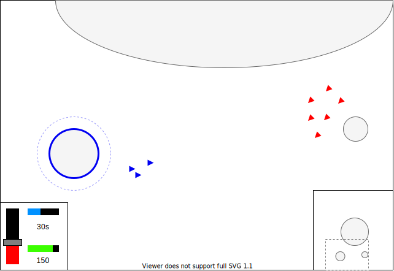

# Design

Kadigan is a single player skirmish RTS set in a dynamic world.

## Gameplay overview

A simplified take on an RTS. You command a fleet of ships tasked to defend your moon base and destroy the enemy's base.

The world is always changing - the moons continue their slow and steady orbit around the central planet.

Your economy management is distilled into a single slider. At 100% production, all your available resources are funnelled into creating ships which will be produced slower over time. At 100% investment, all your resources are funnelled into investments which increase your bank and allow you to produce more ships faster over time.

You can gather additional resources around the map by "creeping" - destroying neutral enemies that only fight when approached. These neutrals are based around neighbouring moons, and randomly respawn after being destroyed.

Over time, you can gain an upper hand by taking cost-efficient trades with the enemy, investing harder than they do, or harvesting more creeps. You have to do all this without perfect information - beyond the range of your base and units there lies darkness.

Once you're ready to strike, you can attack the enemy base by destroying the defenders & surrounding it. If unchallenged, you will force a surrender & emerge victorious.
